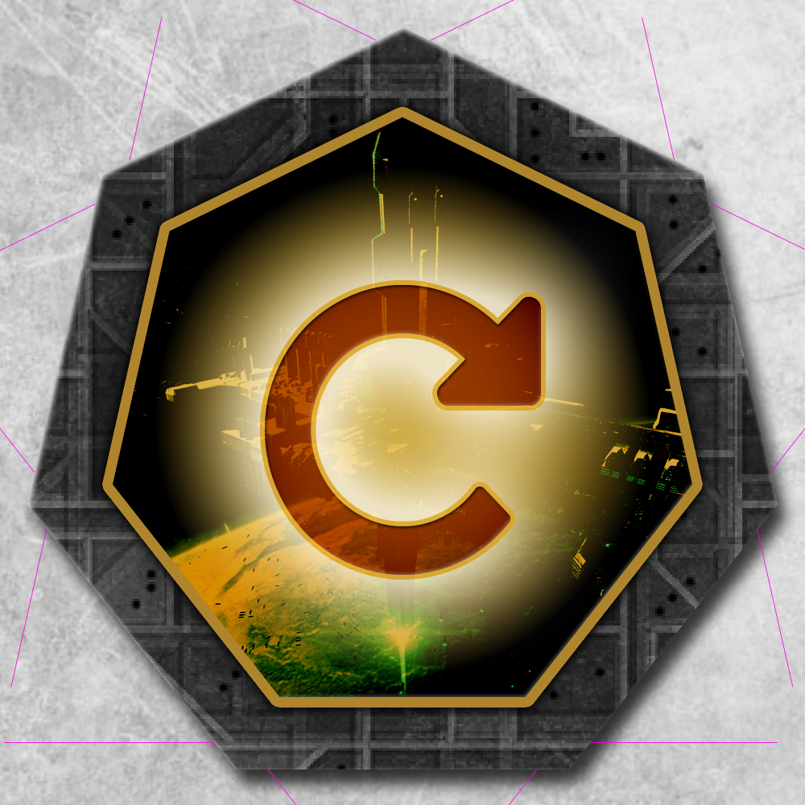
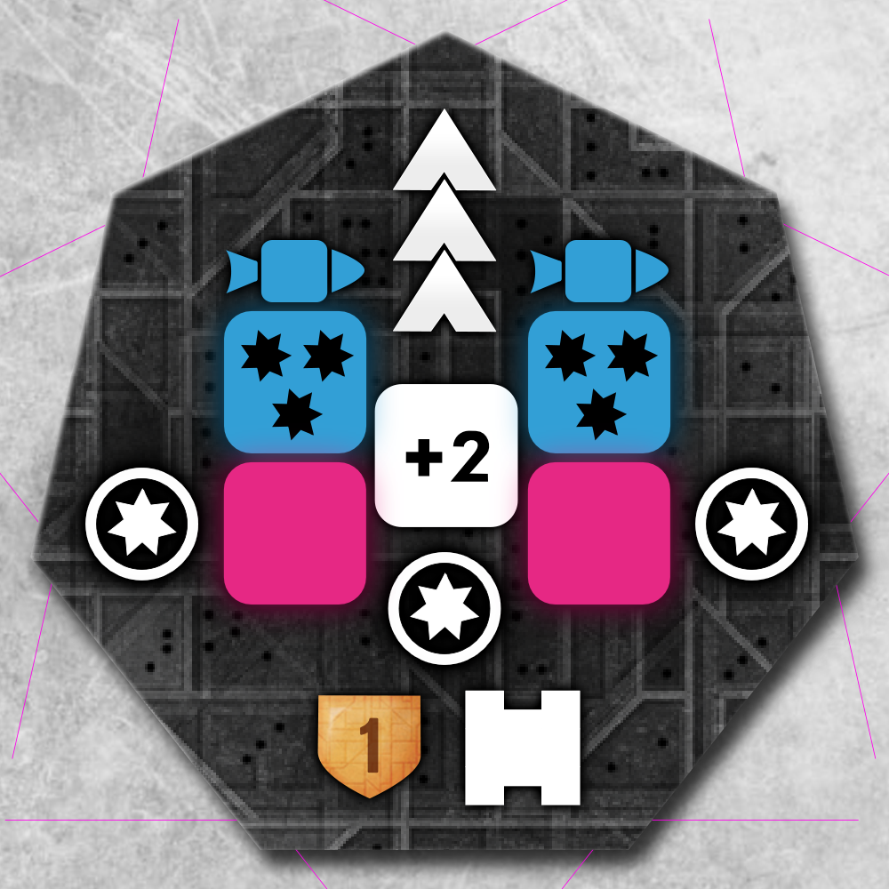
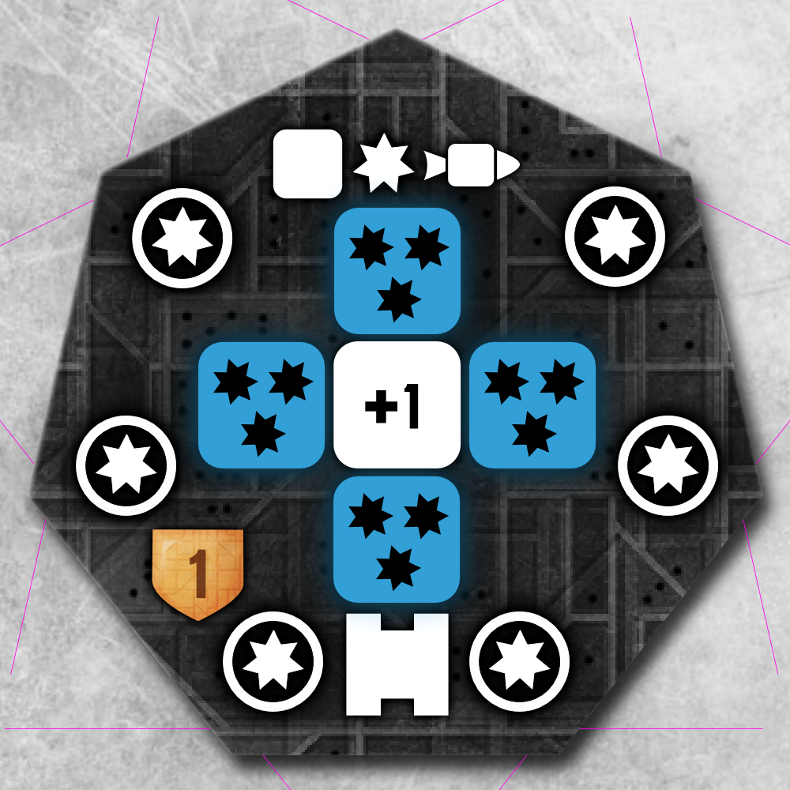

Galactic Center Battle Fleet
============================

_The Galactic Council was not amused with the rumors about GCDS's in parallel galaxies being destroyed with much ease all over the place. They decided that mere defending the Galactic Center was no longer sufficient. They choose to BATTLE!_

Background
----------

Ever since my first game of **Eclipse** I have never been really impressed by the GCDS. While during the explanations of the game the GCDS seems an almost godlike thing in the middle, during your first game you'll see one of your opponents just go in on round 4 or 5 and conquer the thing, like just any other ancient (okay, the fighting was a bit rougher, but still).

I wanted to create some **force** that is not only defending the GC, but is impressive enough to have people think over their silly plans to walk into that #001 Hex, with the possibility to screw themselves, or even their fellow players. Look at this expansion more as a _mission_. This force could become that massive that it changes the game, you are no longer competing with your opponents, you are playing **against that force**; it could become that powerful that the only way to take care of it is by **co-op**.

Work in progress / Disclaimer
-----------------------------

1. This is a work-in-progress. I just started writing and let things evolve from there. I am open to suggestions for changes and add-ons to this text.
2. I am not a native english speaker, coming up with rules that are only interpretable in one way is hard. Putting them down in a language that is not your own is even harder...
3. While describing my idea I choose to use the chronological order, which might use terms that are explained later in the document. This makes it a bit unclear reading the document for the first time, but will help you much better when playing the game.

GCDS vs GCBF vs BF-ship
-----------------------

Let's first clarify the terms GCDS, GCBF and BF-ship. 

- Normal gameplay involves only the GCDS. All GCDS's in this expansion are played exactly as the ordinary GCDS from the base-game. 

- A GCBF is different. It's a different token, with a mysterious looking GCBF upside and an GCBF-type icon on the flipside. 

- This ruleset talks about BF-ship whenever a new ship is introduced to the board as a consequence of these rules, depending on the variantion you choose to play this is either a GCDS or a GCBF. _(see below)_

1. Preparation
--------------
Decide before gamestart how you want to play:

nr | Choose your gamestyle
--- | ---
1.1 | Determine the moment you want to **reveal the identity** of the GCBF: at **Gamestart** or **On-Entry**; when the first player moves a ship into the #001 hex. On-Entry is recommended, but I would still like to add this as a variation to the rules, because I know that some people will never want to even play-test this expansion because of all the surprises and trouble that it will throw upon them......
1.2 | Determine how to treat new spawned or moved **BF-ships**: as a ordinary **GCDS** or as another **GCBF**, this way they could go viral! So when the rules talk about BF-ship, it's either a GCDS or a GCBF, depending on which variantion you decided to play.
1.3 | Determine if you want to use the **On Defeat** tokens.

2. Setup
--------

Make closed piles of the GCDS's, GCBF's and On Defeat tokens and put them aside the board. Instead of an ordinary GCDS, draw a GCBF token and put it on the #001 hex. Depending on your chosen variant you put it mysterious-side or all-revealing-side up. Just play the game as normal.

3. On Entry
-----------

Entering the #001 Hex (or any hex with a GCBF), flip the GCBF token to it's GCBF-type side if it is not already on that side and see what it does:

nr | type | token | explanation
--- | --- | --- | ---
3.1 | The Hive |  | On all six hexes around the current hex a new BF-ship spawns. The initial GCBF is replaced with a GCDS.
3.2 | The Attack |  | Instead of the attacker moving into the hex another BF-ship enters the hex the attacker came from. The initial GCBF is replaced with a BF-ship.
3.3 | The Fleet |  | Not one, but _n_ GCDS's in the hex depending on round nr. (1-3: 1, 4-6: 2, 7-9: 3, continue when playing more rounds). Replace the initial GCBF with _n_ GCDS's.
3.4 | The Reply |  |  Number of GCDS's is equal to number of participants in the **GCET** _(see below)_. Replace the initial GCBF with _n_ GCDS's. _Leave this one out of the game when you are not going for the viral version in which a BF-ship is a GCBF._
3.5 | The Hop |  | Another BF-ship 'hops' the attacker and spawns in the hex behind the hex the attacker came from and yes in a 6 player game that would most likely mean it will end up in _soneone's_ homeworld.
3.6 | The Dice |  | Roll a d6 and put a new BF-ship in the right hex on 2 to 6. Replace the initial GCBF with a GCDS. In the case the roll is a 1, put 2 GCDS's in the attacked hex.

**NOTE:** Standard rules do apply, both GCDS and GCBF pin **all** ships. Draco **must** fight GCDS and GCBF.

_**Design note:** At first the idea was to decide the type by a d6-role but later it was clear that a better idea would be to have GCBF-tokens with some fancy GCBF artwork on the upside and an icon representing the GCBF-type on the flip: entering a GCBF controlled hex you would flip the token and see what you are dealing with... This would also reduce the stress of coming up with exactly 6 funny GCBF-types and also allow different parties to decide to exclude any type they might dislike (or add some they came up with themselves, for that matter)_

4. On Defeat
------------

_Skip this when you decided at gamestart not to use the On Defeat tokens._  
At the end of the combat round, whenever a tile is cleared of all GCDS's on it they have a little surprise for the players. Draw a GCBF defeat token.

**Note:** This happens after the combat round, so whatever the outcome, you have a full round to counter these attacks, when they happen in round 9, nothing happens.

nr | type | token | explanation
--- | --- | --- | ---
4.1 | The Sneak |  | a GCDS in the attacker's home hex, no matter who owns it! Hahaha! When there were more players involved in the attack, all attackers homeworlds get an **ancient cruiser**.
4.2 | The Return |  | a new GCDS spawns in same hex, pin rules do apply, populating the planets is not allowed!
4.3 | The Retreat |  | GCDS moves away (d6) is not destroyed and makes a full recovery!
4.4 | The Blast |  | The blast of the GCDS triggered all their spare weapons to go off and evaporate all ships still left in the hex. This one does impact the ships present in the hex immediately!
4.5 | The Raid |  | Every Ancient, GCDS or GCBF in any of the adjacent hexes moves to your hex. GCBF's are treated as follows: If only **one** GCBF ends up in your hex (with or without any other ancients or GCDS's): treat the GCBF as a GCBF, flip it. When there are more than one GCBF, change all GCBF's to GCDS's!

5. On moving or spawning GCBF's
--------------------------------

When a ship is moved or spawned into a hex where there is already one GCBF, GCDS or Ancient, they technically form a **Fleet**. Any GCBF in the Fleet must be replaced with a GCDS.

6. Co-op Rules
-----------

At any point in the game the players might find themselves overwhelmed with the strenght of the GCBF and decide to co-op. Players (some or all) might join the **GCET** or **Galactic Center Elimination Treaty**.
The following rules apply (loosly based on _alliances_ from RotA):

**This section is highly WIP!**

nr | Co-op rules
--- | ---
6.1 | Players that are members of the **treaty** can fight the Fleet together, just like the _alliances_ from RotA.
6.2 |  **Only on hexes with a BF-ship** the presence of ships from two or more players that are part of the **treaty** is not seen as an act of war. _**Example:** Player A and B are both in the treaty and are both in hex #001 attacking the GCBF. But also somewhere else on the board they both have presence in the same hex. The battle in the #001 hex is done co-op, but they first have to fight each other in the other hex._
6.3 | When 3 players are in a hex and only two are a member of the GCET at the start of the combat phase, the players first fight each other before fighting the Fleet.
6.4 | When all GC-ships on a hex are destroyed and only player-ships are present, the **treaty** accepts the status-quo. So nobody is pinned by nobody. But when the next **combat phase** begins, normal rules apply. _**Example:** Player A, B and C are in the treaty and they beat the shit out of the BF-ships on the hex. In the next round Player A decides to move on and takes his ships elsewhere but at the end of this round both Player B and C still have ships in the hex, they must fight each other during the combat phase._
6.5 | Joining the **GCET** is easy. You just say "I'll join the GCET!" And that player puts a GCET token on his playerboard.
6.6 | Leaving the **GCET** is also easy. You juts say "I'll leave the GCET!" And you return your GCET token from your playerboard.
6.7 | You are not allowed to leave the treaty in the same round you joined it, or vice versa: you are not allowed to join the treaty in the same round you left it.
6.8 | When The Reply is flipped, the size of the Fleet is immediately determined by the number of GCET members at the moment of flipping the token. Players may join or leave after that, but this does not change the number of ships in the Fleet.

7. GCDS variants
----------------

In order to have more than the 'basic' three GCDS's chips, I created a bunch of extra GCDS's and also remade the official GCDS's in the same design, mainly to have all 5 of them and being able to stack them and do random draws. And there are some fan made GCDS's

nr | origin | token | ini | msl | can | cmp | shl | hls | xtr 
--- | --- | --- | --- | --- | --- | --- | --- | --- | ---
001 | Base |  ||| 4x1 | +1 || 7 |
002 | RotA |  | 4 |4x1 | 1x4 | +2 || 3 |
003 | RotA |  | 3 || 2x2 | +2 || 5 
004 | SP1 |  | 3 || 3x2 | +2 || 4 |
005 | SP1 |  | 4 || 2x4 | +1 | -2 | 4 |
101 | DonSchneider's |  | 4 || 2x4 | +1 | -2 | 4 | Point defence
103 | DonSchneider's |  | 3 || 3x1 | +2 | -1 | 6 | Regeneration
104 | DonSchneider's |  | 4 || 2x4 | +1 | -2 | 6 |
105 | DonSchneider's |  | 4 || 2x2 2x4 | +1 | -2 | 4 | Point defence
107 | DonSchneider's |  | 3 || 6x1 | +2 | -2 | 5 |
108 | DonSchneider's |  | 3 | 2x4 | 2x2 | +2 | -2 | 5 |
201 | Advanced GCDS's |  | 4 || 2x3 | +2 || 4 | Regeneration
202 | Advanced GCDS's |  || 1xRift | 2xRift ||| 5 |  2xRegeneration
203 | Advanced GCDS's |  | 3 | 2x3 | 2xRift | +2 || 3
204 | Advanced GCDS's |  | 1 | 2xRift | 3x2 | +1 | -1 | 4 
205 | Advanced GCDS's |  ||| 2xRift || -1 | 7
206 | Advanced GCDS's |  ||| 4x3 | +1 || 6 | Point defence 
207 | Advanced GCDS's |  | 6 | 3x1 | 2x3 | +1 || 3 
208 | Advanced GCDS's |  | 4 | 2x4 | 2x3 | +1 || 4 | Regeneration
301 | Vanish |  | 4 || 2x1g | +2 | -1 | 4 | The Graviton Pulse does one damage to **all** enemy ships in the hex.

**Sources:**

- Base/RotA/SP1: Original GCDS's from basegame, Rise of the Ancients and Ship Pack One respectively.
- DonSchneider's: [Galactic center for true mazocists XD](https://boardgamegeek.com/image/2454099/eclipse?size=original)
- Advanced GCDS's: [Veector requested some SotR compatible GCDS's so I made some...](https://boardgamegeek.com/thread/1704307/request-new-advanced-gcds-new-techs/page/1)
- Vanish: [Vanish has a lot of stuff, the Graviton Pulse tech can be found here...](https://boardgamegeek.com/filepage/99457/eclipse-techs-archadium)

**Further idea's**

I also saw a couple of Growing GCDS variants on the BGG-forum, which might be interesting...

- [VolkoV's Growing GCDS](https://boardgamegeek.com/article/8385519)
- [Toxic_Rat's Growing GDCS](https://boardgamegeek.com/thread/856074/variant-gcds)

The last idea I want to mention here is a scripted BF-ship. Which has its own board where blueprint, tech, position etc is managed... A combination of the growing GCDS and stuff.....

License
-------

The image I used is copyright of Brad Wright, my attempts to contact him to ask permission to use the image have been unanswered, so I am looking for another image that does capture the atmosphere I am looking for. As soon as I found one I will replace this...

 This work, which includes everything in this repository, is licensed under a <a rel="license" href="http://creativecommons.org/licenses/by-nc-sa/4.0/">Creative Commons Attribution-NonCommercial-ShareAlike 4.0 International License</a>.

